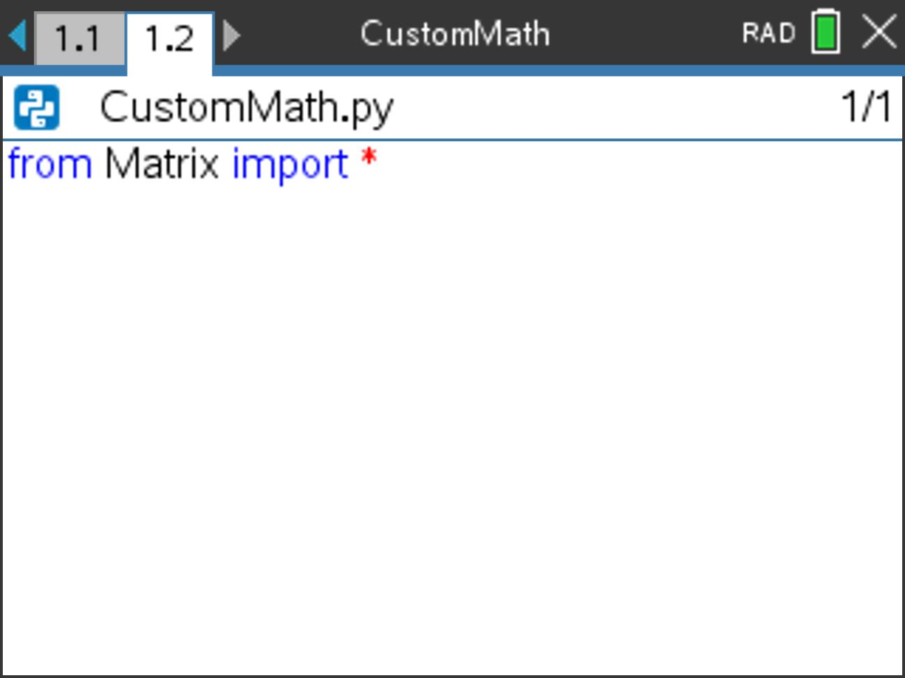
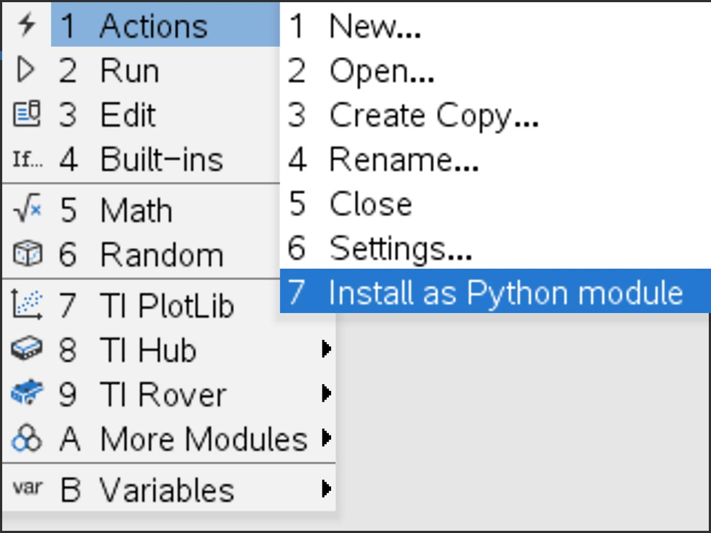
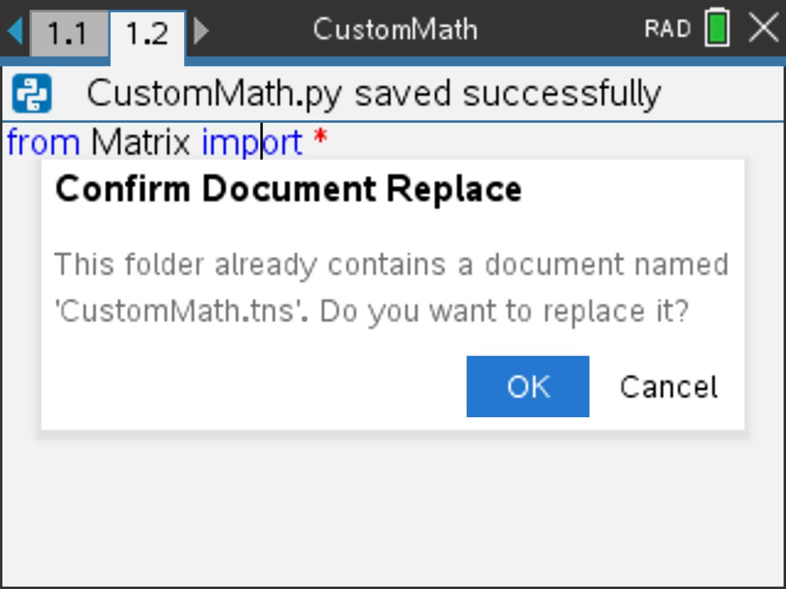
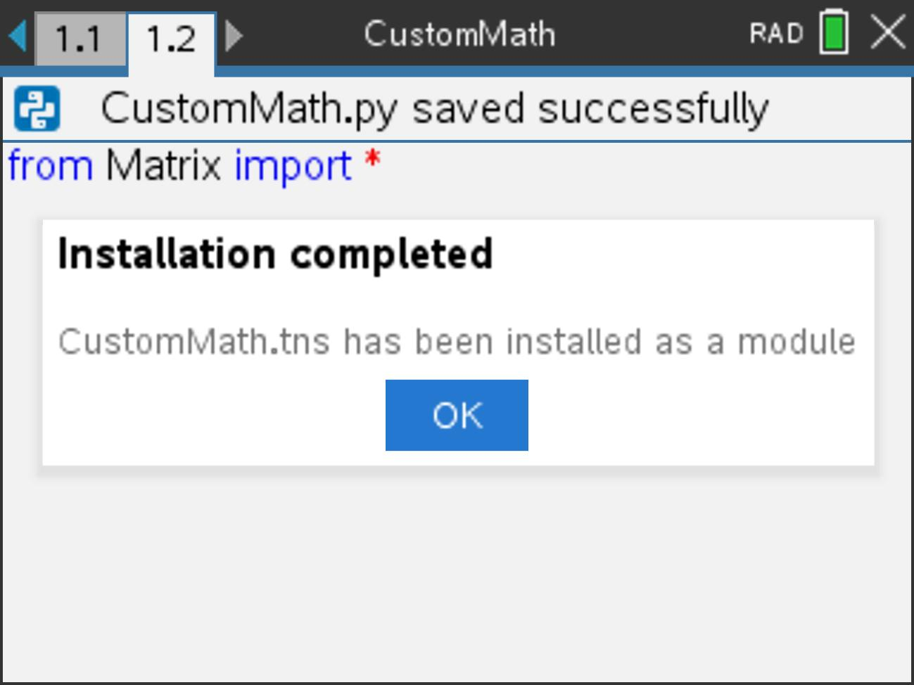
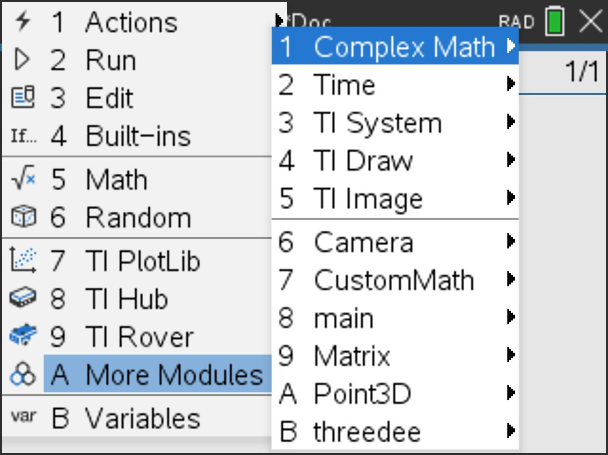

# TinSpire

    
    

A collection of custom Python/TI-Basic libraries for the TI-Nspire CX II Family made for recreational computing and mathematics.
## Table of Contents
- [Python Libraries](#python-libraries)
	+ [CustomMath](#custommath)
		* Matrix
	+ [threedee](#threedee)
		* Camera
		* Point3D
- [TI-BASIC Programs](#ti-basic-programs)
- [Installation](#installation)
	+ [Transfering Files](#transfering-files)
## 🗒️ Note
>These libraries have only been tested on a factory TI-Nspire CX II CAS with the latest firmware. 
All other firmware and hardware has not been proven to work, but most likely will.
## 🐍 Python Libraries
### CustomMath
An extended math library designed to replace certain functions and data structures from `numpy` and other commonly used math libraries. 
**Current Submodules**
- Matrix - Barebones matrix math implementation
### threedee
A collection of tools used for 3D rendering and calculations. 
**Current Submodules**
- Camera - Camera class used in `threedee.Point3D` for projection
- Point3D - A class for creating, representing, and manipulating 3D points
## TI-Basic Programs
No TI-Basic programs are currently being developed for TinSpire, but keep an eye out!
## Installation
### Transfering Files
Use the table below to choose the best software for your use case:
| Software | Model(s) | Requires Activation | Offline | Open-Source | Supports Firefox |
| -------- | -------- | ------------------- | ------- | ----------- | ---------------- |
| [N-Link (Online)](https://n-link.lights0123.com/) (Recommended Online) | CX II / CX II CAS | no | no | yes | no |
| [N-Link](https://lights0123.com/n-link/) (Recommended Offline) | CX II / CX II CAS | no | yes | yes | N/A |
| [Ti-Nspire&#x2122; CX II Connect](https://nspireconnect.ti.com/) | CX II / CX II CAS | no | no | no | no |
| [Ti-Nspire&#x2122; CX CAS Student Software](https://education.ti.com/en/products/computer-software/ti-nspire-cx-cas-student-sw) | CX II CAS | yes | yes | no | N/A |
| [Ti-Nspire&#x2122; CX Student Software](https://education.ti.com/en/products/computer-software/ti-nspire-cx-student-sw) | CX II | yes | yes | no | N/A |

Once you've found a software that works, download the latest release of `PyLib.zip`. 
Once downloaded, extract the `PyLib` directory and copy it to the root of your calculator, merging it with the existing `PyLib` directory. 

2) To install each module, navigate to each new document in the `PyLib` directory and:
    1) Navigate to the python file with the same name as the module.  (For example, to install the `CustomMath` module, navigate to `CustomMath.py`)
    
    

    
    2) Press the "menu" key and go to `Actions` > `Install as Python module` and hit "enter".
    
    

    
    3) Confirm document replacement by selecting "OK". You should see a dialogue box confirming the installation of the module.
    
    

3) To confiirm the modules have been installed succesfully, TinSpire's modules and sub-modules should show up in the `More Modules` sub-menu when editing a Python file.

